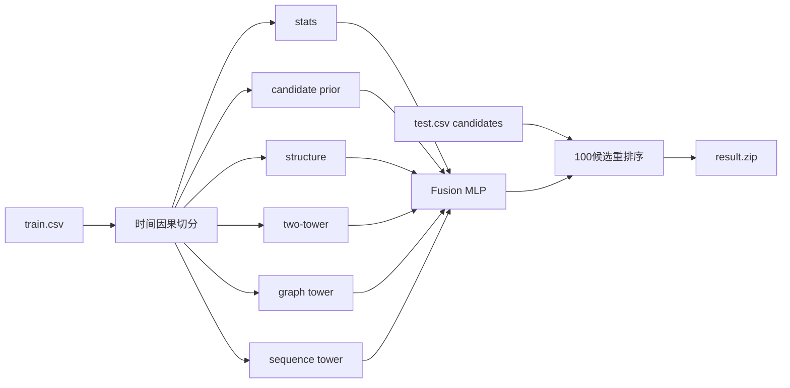

# jittor-GPNUT1-JGRec 文档

本项目面向第六届计图人工智能挑战赛赛道一动态推荐任务。核心交付物是
`result/<run_id>/result.zip`：压缩包根目录直接包含每个数据集对应的预测 CSV。

## 提交入口

当前优先阅读：

| 目标 | 文档 |
| ---- | ---- |
| 确认当前提交包和提交前检查 | [提交说明](/operations/submission/) |
| 了解运行命令和常用参数 | [运行手册](/operations/runbook/) |
| 确认输入输出格式 | [数据契约](/task/data-contract/) |
| 理解当前 hybrid 模型 | [模型设计](/system/modeling/) |
| 理解代码模块和数据流 | [系统架构](/system/architecture/) |
| 查看实验记录和性能优化 | [实验与基准](/experiments/benchmarks/) |

## 当前模型

默认后端是 `hybrid`。它不是单一 GNN，而是一个候选级混合重排序系统：



特征顺序：

```text
stats + candidate_prior + structure + two_tower + graph + sequence
```

训练时会在 `stats`、`stats_prior`、`stats_prior_structure`、
`stats_prior_structure_tower`、`stats_prior_structure_tower_gnn`、
`stats_prior_structure_tower_gnn_seq` 等特征组之间做验证选择。

## 当前提交候选

```text
result/hybrid_full_d1d2_50k20k_mrr_r100_ch32_seed60/result.zip
```

线上反馈：

```text
1.1983
```

该包为全量 `dataset1` + `dataset2` 重新生成结果，不使用 `--dataset` 或 `--limit-rows`。新的冲分实验
仍建议先单跑 `dataset2`，确认线上反馈后再决定是否替换完整提交包。

## 最短路径

```bash
uv sync
uv run jgrec-build
```

冒烟：

```bash
uv run jgrec-build --limit-rows 2 --max-fit-events 512 --max-train-events 32 --max-val-events 16 --num-negatives 3 --epochs 1 --disable-gnn --disable-seq
```

提交前不要使用 `--limit-rows` 产物。

## 文档分组

### 任务与数据

- [赛题说明](/task/competition/)
- [数据契约](/task/data-contract/)
- [当前数据画像](/task/data-profile/)

### 系统与模型

- [系统架构](/system/architecture/)
- [模型设计](/system/modeling/)

### 运行与开发

- [提交说明](/operations/submission/)
- [运行手册](/operations/runbook/)
- [开发规范](/operations/development/)

### 实验与研究

- [实验与基准](/experiments/benchmarks/)
- [研究问题综述](/research/problem-overview/)
- [GNN 推荐论文调研](/research/gnn-survey/)
- [推荐系统论文调研归档](/research/recommender-survey/)
- [开源参考](/research/open-source-references/)
