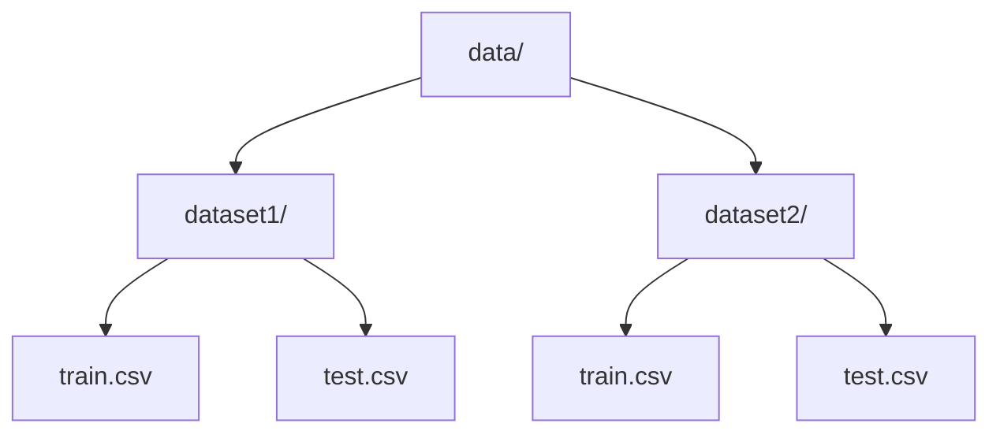
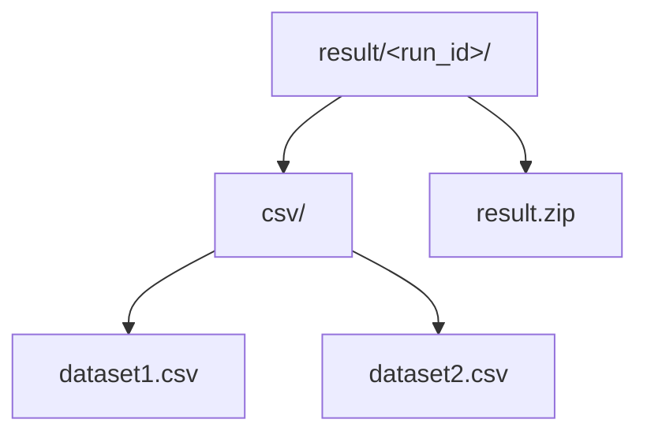

# 运行手册

## 前置条件

- Python 版本由 `.python-version` 固定为 `3.12`。
- 依赖由 `uv.lock` 锁定。
- Jittor 与 JittorGeometric 通过 `third_party/` 本地路径安装。
- 正式赛数据放在 `data/` 下。`data/` 已在 `.gitignore` 中，不应提交到仓库。

## 数据目录



程序会扫描 `data/` 下所有同时包含 `train.csv` 和 `test.csv` 的子目录。子目录名就是输出文件名，例如 `dataset1` 对应 `result/<run_id>/csv/dataset1.csv`。

## 环境同步

```bash
uv sync
```

如需构建文档：

```bash
uv sync --group dev
```

## 生成提交文件

```bash
uv run jgrec-build
```

默认会为每个数据集做一次时间切分训练。`temporal-graph` 后端使用 JittorGeometric temporal neighbor sampler 构造因果历史邻域，再用 CRAFT-style cross-attention 和候选集 softmax 做端到端重排序训练；验证使用 train.csv 尾部 15%，早停默认看 AP，同时打印 MRR 作为诊断指标。
CLI 使用 Rich 输出运行面板、训练进度和结果表格；提交文件仍只写入 `result/`，终端样式不会影响 CSV/ZIP 内容。

默认切分比例为：

\[
|\mathcal{E}_{\text{val}}|
= \lfloor 0.15 |\mathcal{E}_{\text{train}}| \rfloor,
\qquad
|\mathcal{E}_{\text{fit}}|
= |\mathcal{E}_{\text{train}}| - |\mathcal{E}_{\text{val}}|.
\]

模型后端通过 `--model` 选择：

```bash
uv run jgrec-build --model temporal-graph
uv run jgrec-build --model craft
```

默认输出：



`result.zip` 是固定文件名，始终位于本次运行目录内。`<run_id>` 使用人类可读短名，最后追加 8 位配置哈希避免不同隐藏参数写入同一目录。

默认规则：

```text
{model}_{full|sample-N-rows}_{cpu|cuda}_seed-{seed}_{hash}
```

`temporal-graph` 后端会额外追加历史长度和 hidden size：

```text
temporal-graph_full_cuda_seed-42_hist-64_candhist-32_dim-128_1a2b3c4d
temporal-graph_sample-2-rows_cpu_seed-42_hist-8_candhist-4_dim-32_1a2b3c4d
```

## 冒烟测试

快速验证完整端到端模型路径：

```bash
uv run jgrec-build --limit-rows 2 --max-fit-events 512 --max-train-events 32 --max-val-events 16 --num-negatives 3 --epochs 1 --history-len 8 --candidate-history-len 4 --hidden-size 32 --layers 1 --heads 2 --no-refit-full --quiet-ranker
```

该命令适合验证环境、Jittor/JittorGeometric 初始化、CSV 读写和压缩包生成。

只验证提交链路、进一步缩小训练量：

```bash
uv run jgrec-build --limit-rows 100 --max-fit-events 2048 --max-train-events 256 --max-val-events 128 --num-negatives 7 --epochs 1 --history-len 16 --candidate-history-len 8 --hidden-size 64 --layers 1 --heads 2 --no-refit-full --quiet-ranker
```

并行调参时必须使用不同参数组合，使生成的 `<run_id>` 不同；相同参数组合会写入同一个运行目录。

## CPU 运行

```bash
uv run jgrec-build --cpu
```

没有 GPU 时可以使用 `--cpu`。完整混合模型在 CPU 上会明显变慢，建议先用冒烟参数确认流程。

## 常用参数

| 参数                    |    默认值 | 说明                                       |
| ----------------------- | --------: | ------------------------------------------ |
| `--model`               |  `temporal-graph` | 模型后端：`temporal-graph`、`craft` |
| `--data-dir`            |    `data` | 数据根目录                                 |
| `--batch-size`          |    `2048` | 每次送入 Jittor 的测试查询数               |
| `--limit-rows`          |        无 | 每个数据集最多输出的测试行数               |
| `--val-ratio`           |    `0.15` | `train.csv` 尾部验证比例                   |
| `--max-train-events`    |   `20000` | 每个数据集最多训练监督事件                 |
| `--max-val-events`      |    `5000` | 每个数据集最多验证事件                     |
| `--num-negatives`       |      `99` | 每个正样本采样负候选数                     |
| `--max-fit-events`      |       `0` | 模型训练历史尾部截断，0 表示全量           |
| `--epochs`              |       `8` | temporal graph 训练轮数                    |
| `--train-batch-size`    |     `256` | 训练 batch size                            |
| `--lr`                  |   `0.001` | 端到端模型学习率                           |
| `--selection-metric`    |      `ap` | 早停选择指标                               |
| `--early-stop`          |      `10` | 早停 patience，0 表示关闭                  |
| `--history-len`         |      `64` | 源节点历史邻居长度                         |
| `--candidate-history-len` |    `32` | 候选节点历史邻居长度                       |
| `--hidden-size`         |     `128` | embedding 和 attention hidden size         |
| `--layers`              |       `3` | cross-attention 层数                       |
| `--heads`               |       `4` | attention heads                            |
| `--no-refit-full`       |      关闭 | 跳过验证后全量重训                         |
| `--seed`                |      `42` | 采样随机种子                               |
| `--quiet-ranker`        |      关闭 | 隐藏训练 epoch 进度和细节日志              |
| `--cpu`                 |      关闭 | 禁用 CUDA                                  |
| `--skip-validate`       |      关闭 | 跳过输出格式校验                           |

## 输出校验

默认运行会校验：

- 每个输出 CSV 行数等于对应 `test.csv` 数据行数。
- 每行正好 100 列。
- 每个概率满足 \(p_{i,j}\in[0,1]\)。

手工验证压缩包内容：

```bash
uv run python - <<'PY'
import zipfile

with zipfile.ZipFile("result/<run_id>/result.zip") as zf:
    print(zf.namelist())
PY
```

## 已验证数据规模

当前本地数据：

| 数据集     | 训练行数 | 测试行数 |
| ---------- | -------: | -------: |
| `dataset1` |   690848 |    61051 |
| `dataset2` |  2261283 |   153420 |

完整生成后：

| 文件                               |   行数 |
| ---------------------------------- | -----: |
| `result/<run_id>/csv/dataset1.csv` |  61051 |
| `result/<run_id>/csv/dataset2.csv` | 153420 |

## 常见问题

### Jittor 找不到 `python3.12-config`

仓库根目录的 `sitecustomize.py` 会设置 Jittor 所需的 Python/CUDA 环境变量。正常通过 `uv run jgrec-build` 运行即可加载。

### ZIP 工具不可用

生成压缩包不依赖系统 `zip` 或 `unzip` 命令，代码使用 Python 标准库 `zipfile`。

### 结果文件很大

正式赛要求每个测试查询输出 100 个 8 位小数概率。当前本地输出约为：

- `result/<run_id>/csv/dataset1.csv`: 65 MB
- `result/<run_id>/csv/dataset2.csv`: 161 MB
- `result/<run_id>/result.zip`: 55 MB
