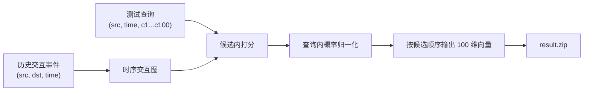
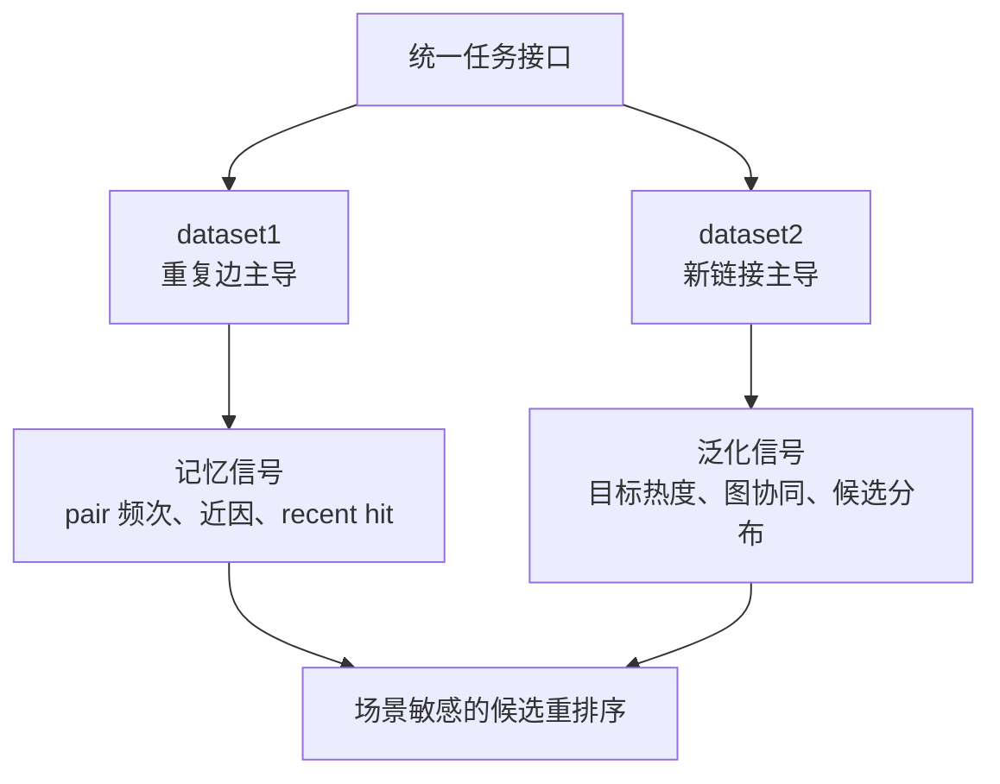
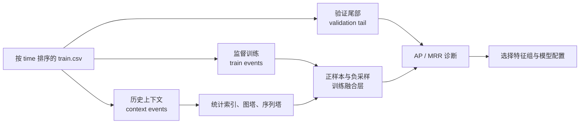
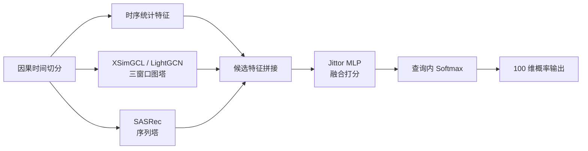

# 动态图候选重排序综述

## 摘要

动态图推荐任务通常同时涉及时间序列建模、图结构学习与排序优化。第六届计图人工智能挑战赛赛道一“基于图学习的动态推荐任务”可被形式化为一个 ID-only 时序交互图上的候选内未来链接重排序问题：给定历史交互事件 \((s,d,t)\)，模型在测试阶段面对查询 \((s_q,t_q,C_q)\)，其中 \(C_q\) 为 100 个候选目标节点，需要估计每个候选在查询时间之后与源节点发生交互的相对可能性。与开放域召回或通用链接预测不同，该任务的候选集合在测试时已经给定，因此方法重点从全库检索转向候选集合内部的因果排序、时序泛化与特征融合。

本文从任务形式化、数据特性、方法谱系、验证协议和工程约束五个方面对该任务进行梳理。数据画像显示，不同数据集可能呈现显著不同的生成机制：一类场景由重复边和近期行为主导，另一类场景则以已知节点之间的新链接预测为主。这种异质性要求模型同时吸收统计记忆、目标热度、序列兴趣、高阶图协同与候选分布校准等信号。综述最后归纳若干开放研究问题，为后续模型设计和实验评估提供统一问题框架。

关键词：动态图学习；候选重排序；推荐系统；未来链接预测；图神经网络；序列推荐；因果验证

## 1. 引言

许多推荐与交互系统可以被抽象为随时间演化的图。节点表示用户、物品、网页、作者或其他实体，边表示在特定时间发生的交互。与静态图建模相比，动态图学习不仅需要刻画节点之间是否存在连接，还需要描述连接发生的时间、重复关系、行为序列以及结构邻域随时间的变化。

在该类问题中，未来链接预测是一个基本任务。给定历史事件序列，模型需要预测某一源节点在未来时间可能连接的目标节点。然而，实际推荐系统通常包含召回、粗排、精排和重排等多个阶段。若测试接口已经给出候选集合，则研究对象不再是全量目标空间上的检索，而是固定候选集合内部的排序问题。赛道一的输入输出形式正符合这一设定：训练集只包含节点 ID 和时间，测试集为每个查询提供 100 个候选目标节点，评价指标主要关注真实目标在候选列表中的排序位置。

因此，该任务可概括为 **ID-only 时序交互图上的候选内链接重排序**。这一表述同时限定了三个重要边界：第一，输入不包含文本、图像、类别或节点属性；第二，模型不能借助查询时间之后的事件；第三，预测结果需要以候选顺序输出 100 维概率向量。上述约束使得统计规律、时间因果性、候选分布和排序损失成为方法设计的核心。



## 2. 任务形式化

### 2.1 交互图与事件序列

设训练集为按时间排列的交互事件集合：

\[
\mathcal{E}=\{(s_i,d_i,t_i)\}_{i=1}^{N}.
\]

其中 \(s_i\) 表示源节点，\(d_i\) 表示目标节点，\(t_i\) 表示事件时间。根据数据集语义，源节点和目标节点可以来自同一节点空间，也可以分别属于二部图的两个节点集合。前者通常更容易出现重复交互和同构结构信号，后者则更接近用户-物品式推荐图。

测试集中每一行查询可写为：

\[
q=(s_q,t_q,C_q), \qquad
C_q=\{c_1,c_2,\ldots,c_{100}\}.
\]

模型只能使用查询时间之前的历史：

\[
\mathcal{E}_{<t_q}=\{(s_i,d_i,t_i)\in \mathcal{E}:t_i<t_q\}.
\]

### 2.2 候选内打分与概率输出

对候选 \(c_j\)，模型输出一个未归一化分数：

\[
z_j=f(s_q,c_j,t_q,\mathcal{E}_{<t_q}).
\]

提交文件要求输出概率值，因此通常可在每个查询的候选集合内部做 softmax：

\[
p_j
=\frac{\exp(z_j)}
{\sum_{k=1}^{100}\exp(z_k)},
\qquad
\sum_{j=1}^{100}p_j=1.
\]

需要注意的是，官方 MRR 本质上依赖分数相对顺序，而不是概率校准误差。因此，概率输出是提交格式要求，排序质量才是主要优化目标。

### 2.3 评价指标

若真实目标在第 \(i\) 个查询中的排序位置为 \(\operatorname{rank}_i\)，则倒数排名和平均倒数排名为：

\[
\operatorname{RR}_i
=\frac{1}{\operatorname{rank}_i},
\qquad
\operatorname{MRR}
=\frac{1}{|\mathcal{Q}|}
\sum_{i=1}^{|\mathcal{Q}|}
\frac{1}{\operatorname{rank}_i}.
\]

MRR 对头部排序非常敏感。将真实目标从第 2 位提升到第 1 位带来的增益显著大于将其从第 50 位提升到第 49 位。因此，候选内难负样本、候选分布匹配和并列分数处理都会直接影响最终评价。

### 2.4 真实数据样例

训练文件中的每一行对应一个带时间戳的交互事件。以下样例直接来自本地 `data/` 目录：

```csv
# data/dataset1/train.csv
src,dst,time
2,3,0
5,5,699798
2,3,764356
2,3,948491
6,6,1029970
2,3,1877394
```

```csv
# data/dataset2/train.csv
src,dst,time,split
123628,23514,955497600,0
138882,55785,955843200,0
123628,100400,956448000,0
135290,101346,956448000,0
123628,75960,956448000,0
```

这两段已经体现出数据机制的差异。`dataset1` 中 \((2,3)\) 在很早的时间内多次重复出现，说明 pair 记忆可能直接成为有效信号；`dataset2` 则额外带有 `split` 列，但当前建模只使用 `src`、`dst` 和 `time`，其 ID 空间更接近源节点与目标节点分离的二部图。

测试文件没有真实 `dst` 标签，而是给出 100 个候选。下面的行来自 `data/dataset1/test.csv` 第 2 条查询，省略中间部分候选：

```csv
src,time,c1,c2,c3,...,c8,...,c47,...,c56,...,c77,c78,...,c100
3076,129595978,5232,2165,18631,...,40266,...,4886,...,3076,...,40565,40288,...,65
```

对该查询，源节点 `3076` 在查询时间之前已有 12 次历史交互；其最近若干目标为：

```text
(1683, 64336454)
(1683, 64495725)
(4363, 79726910)
(3077, 88209793)
(3076, 89166812)
(1276, 93821507)
(1276, 93844680)
(1276, 94439998)
```

候选 `c56=3076` 曾经作为该源节点的历史目标出现，因此它同时是历史 pair 命中和 recent-32 命中候选。与此同时，`c8=40266`、`c47=4886`、`c77=40565` 和 `c78=40288` 是训练 `dst` 集合中未出现过的候选。这个例子说明，同一条测试查询内部可能同时包含重复边候选、已知目标候选和未见目标候选，模型需要在候选集合内比较这些不同来源的信号。

`dataset2` 的真实测试查询呈现另一种形态。下面是 `data/dataset2/test.csv` 第 1 条查询的压缩展示：

```csv
src,time,c1,c2,c3,...,c13,...,c54,...,c100
138579,1296345600,31799,55214,107375,...,6434,...,7508,...,47615
```

该源节点在查询前有 946 次历史交互。候选 `c13=6434` 与 `c54=7508` 曾出现在该源节点历史中，但都不属于最近 32 个目标；同时，这一行有 60 个候选目标从未在训练 `dst` 中出现。换言之，即使某个源节点历史很长，候选集合也可能包含大量 embedding 表无法直接覆盖的目标，这会削弱纯 ID 图塔的单独解释力。

为了观察有真实标签的排序问题，可以从 `train.csv` 尾部构造 holdout。按时间取前 85% 训练事件为历史上下文时，两个数据集中的典型未来事件如下：

| 数据集     | holdout 未来事件 \((s,d,t)\) | 历史证据                                                                 |
| ---------- | ---------------------------- | ------------------------------------------------------------------------ |
| `dataset1` | \((4629,2670,121216367)\)    | \((4629,2670)\) 已多次出现，最近一次在 \(121197402\)，时间间隔为 18965。 |
| `dataset2` | \((111306,31966,1255824000)\)| 源节点已有 786 次历史交互，目标 `31966` 是已知 `dst`，但该 pair 从未出现。 |

第一个例子代表重复边主导的排序样本：pair 频次、pair 近因和 recent window 都会给真实目标较强支持。第二个例子代表已知节点之间的新链接预测：模型不能依赖历史 pair 复现，而需要从目标热度、源节点画像、共现邻域或候选分布中寻找泛化信号。

## 3. 数据特性与任务形态

本地 A 榜数据画像表明，两个数据集虽然共享同一输入输出格式，但呈现不同的交互生成机制。

| 指标                           | `dataset1` | `dataset2` |
| ------------------------------ | ---------: | ---------: |
| 训练边数                       |     690848 |    2261283 |
| 测试查询数                     |      61051 |     153420 |
| 唯一 `src`                     |      22093 |      12708 |
| 唯一 `dst`                     |      23012 |      50640 |
| 重复事件占比                   |     72.60% |      2.21% |
| holdout 中历史 pair 命中率     |     56.91% |     0.002% |
| holdout 中已知节点新 pair 占比 |     36.88% |     91.75% |

`dataset1` 具有明显的记忆型特征。重复事件占比高，且 holdout 中大量正样本已经在历史中出现过相同 \((s,d)\) pair。这类数据中，pair 频次、pair 近因、同源最近行为和目标热度通常构成强信号。复杂图模型若不能有效保留这些尖锐统计信号，可能无法超过简单统计记忆基线。

`dataset2` 则更接近新链接预测。历史 pair 在 holdout 中几乎不复现，但源节点和目标节点多已在历史中出现。这表明主要难点不是重复边回放，而是在已知节点集合中识别新的源-目标组合。目标热度、时间漂移、高阶共现、源节点画像以及候选分布先验在该场景中更重要。



这一差异说明，动态图推荐 benchmark 中常见的“重复交互”与“新链接泛化”可能同时存在。若单一模型过度依赖历史 pair，会在新链接场景中失效；若完全忽略重复关系，又会损失记忆型场景中的主要解释变量。

## 4. 方法谱系

### 4.1 统计记忆与时间衰减

统计记忆方法直接利用历史事件中的重复关系和流行度信息。典型特征包括 \((s,d)\) 的历史交互次数、源节点对目标节点的重复率、最近一次交互时间差、目标节点全局出现频次、近期目标热度以及源节点活跃度。此类方法没有复杂参数，却常在重复边比例较高的数据上表现强劲。

时间衰减是统计记忆的自然扩展。若 \(\Delta t\) 表示查询时间与最近一次相关事件之间的间隔，常用形式为：

\[
r(\Delta t)=\exp(-\Delta t / \tau).
\]

其中 \(\tau\) 控制近期事件的衰减速度。对动态图推荐而言，时间衰减既可作用于 pair 记忆，也可作用于目标热度和源节点活跃度。

### 4.2 协同过滤与排序损失

矩阵分解和隐式反馈协同过滤将源节点与目标节点映射到低维隐空间，通过内积或相似度刻画偏好关系。Bayesian Personalized Ranking (BPR) 是隐式反馈推荐中的经典 pairwise 目标，其基本思想是拉大正样本和负样本的相对分差。

在候选重排序任务中，pairwise 目标并不完全等价于候选集合内部的 list-wise 排序。若训练阶段的负样本过于简单，模型可能获得较好的二分类或 pairwise 损失，却无法区分真实测试候选中的困难目标。因此，sampled softmax、list-wise cross entropy 和候选分布匹配是更贴近本任务评价形式的训练思路。

### 4.3 序列推荐

序列推荐关注源节点历史行为的顺序结构。FPMC 将矩阵分解与一阶 Markov 转移结合；GRU4Rec 使用循环神经网络建模 session；SASRec 通过自注意力从历史序列中抽取长期与短期兴趣；TiSASRec 进一步显式引入时间间隔。

在本任务中，序列模型的有效性取决于未来目标是否可由源节点近期行为解释。对于重复行为丰富的数据，recent window 和自注意力序列编码可能较强；对于几乎不重复目标的二部图场景，序列塔更可能承担源节点兴趣画像的角色，而不是简单预测“下一个重复目标”。

### 4.4 图神经网络推荐

图推荐方法将交互矩阵视作图结构，并通过邻居传播建模高阶协同关系。NGCF 在 user-item 图上引入图卷积传播；LightGCN 去除特征变换和非线性，仅保留邻居聚合与层级 embedding 融合；SGL、SimGCL 和 XSimGCL 通过图增强或 embedding 扰动引入对比学习正则。

对于候选重排序，图模型的作用不是额外召回节点，而是为给定候选提供协同过滤分数。若源节点与候选目标在二跳或高阶邻域中存在共同结构，LightGCN/XSimGCL 等模型可能补充统计特征无法覆盖的新链接信号。

### 4.5 连续时间动态图模型

JODIE、TGAT、TGN 和 DyGFormer 等模型直接面向连续时间事件流，通常维护节点状态、时间编码和时间邻域聚合机制。这类方法与未来链接预测关系紧密，但工程复杂度、显存消耗和推理成本显著高于轻量统计或静态图推荐模型。

在候选集合已固定的设定下，完整动态图模型的优势需要通过严格离线验证和线上反馈证明。多时间窗口图、时间衰减统计和序列编码可以视为更轻量的时间建模近似。

### 4.6 重排序融合

由于测试候选已经给定，本任务与工业推荐系统中的排序或重排序阶段高度接近。Wide & Deep、DCN、DIN、DIEN 等排序模型表明，统计特征、目标感知历史聚合、特征交叉和深度融合在候选排序中具有重要作用。

一个自然的融合范式是将统计特征、图塔分数和序列塔分数拼接为候选特征向量，再由 MLP 输出候选 logits，并在每个查询内部归一化。该范式避免将所有信号强行并入图消息传递过程，也便于对不同特征组进行消融。

## 5. 验证协议与评价偏差

### 5.1 时间因果性

动态图任务最常见的失效来源是时间泄露。任意统计索引、图结构、序列样本或负采样过程若使用了查询时间之后的事件，都会造成离线指标虚高。因而验证集应从训练事件尾部按时间切出，模型构建和候选打分仅使用验证事件之前的历史上下文。



### 5.2 采样验证偏差

本任务的评价发生在给定的 100 个候选上。若本地验证候选由全局随机负采样构造，而线上候选包含大量热门目标、历史相关目标或共现目标，则离线 MRR 可能系统性偏乐观。该偏差在推荐系统的 sampled metrics 中十分常见。

因此，离线验证至少需要区分三类量：

- 训练损失：用于优化模型参数。
- 本地 AP/MRR：用于诊断候选排序能力。
- 线上 MRR：用于裁决提交系统的真实性能。

离线指标的改进只有在候选分布可解释、时间因果性成立且与线上反馈一致时，才具有较强证据价值。

### 5.3 场景异质性

不同数据集可能对应不同生成机制。记忆型数据倾向于奖励 EdgeBank 式重复边建模；新链接数据则更依赖协同过滤、目标热度与候选先验。验证报告若只给出总 MRR，难以判断模型究竟改善了哪一类样本。因此，分场景、分样本类型和分特征组的诊断具有必要性。

## 6. 工程化基线实例

现有默认模型 `TemporalHybridRanker` 可视为上述方法谱系的一个工程化实例。其基本结构由因果时间切分、统计特征、三窗口图塔、SASRec 序列塔和 Jittor MLP 融合层组成。



特征层包括 pair 记忆、近期行为、目标节点热度、图协同分数和序列偏好分数。融合层比较 `stats`、`stats_gnn` 和 `stats_gnn_seq` 三类特征组，并根据验证指标选择最终特征集合。这种设计的主要作用是将强统计基线与神经表示学习分离，使图塔或序列塔在某一数据集上不稳定时不会必然破坏统计信号。

## 7. 开放研究问题

围绕该任务，可以形成以下研究问题。

| 编号 | 研究问题           | 核心内容                                                            |
| ---- | ------------------ | ------------------------------------------------------------------- |
| RQ1  | 任务边界           | 如何区分候选重排序、开放召回和传统二分类链接预测。                  |
| RQ2  | 场景异质性         | 哪些数据集由重复边主导，哪些数据集由新链接主导。                    |
| RQ3  | 统计信号贡献       | pair 记忆、目标热度、近因和源节点活跃度各自解释多少排序增益。       |
| RQ4  | 图学习增益         | LightGCN/XSimGCL 等图协同分数是否改善已知节点之间的新链接排序。     |
| RQ5  | 序列建模价值       | SASRec 或时间间隔特征是否能刻画源节点兴趣漂移。                     |
| RQ6  | 负采样与候选分布   | random、popular、recent、history negatives 与线上候选分布是否一致。 |
| RQ7  | 离线验证可信度     | 本地 AP/MRR 与线上 MRR 是否保持一致排序。                           |
| RQ8  | 可扩展实现         | 在百万级节点和千万级交互下如何控制训练、推理和输出成本。            |

这些问题强调任务形式、数据机制、模型归因和评价协议之间的耦合关系。复杂模型只有在这些环节被明确控制后，才具有可解释的实验意义。

## 8. 实验协议建议

为了提高实验结论的可复现性和可比较性，模型改动可按统一协议记录：

1. 数据画像：训练边数、唯一节点数、重复 pair 比例、holdout 新链接比例和测试候选覆盖率。
2. 因果切分：按时间构造历史上下文、监督训练事件和验证尾部。
3. 基线对照：比较 `stats`、`stats + LightGCN`、`stats + XSimGCL`、`stats + XSimGCL + SASRec`。
4. 指标记录：分数据集记录 AP、MRR、选择的特征组、训练时间、推理时间和输出校验结果。
5. 消融实验：分别移除 pair、热度、近期、图塔和序列塔，观察信号贡献。
6. 随机性检查：对随机初始化和负采样敏感的模型使用多 seed 复测。
7. 线上锚点：结构性改动需与已知线上基线比较。
8. 提交校验：确认 CSV 行列数、概率范围、8 位小数和 `result.zip` 结构。

该协议并非具体模型的一部分，而是对动态图候选重排序实验中常见混淆因素的控制。

## 9. 潜在研究方向

### 9.1 强统计基线与可解释特征

短期方向是建立稳健的候选重排序基线。统计记忆、多窗口时间衰减、候选内 rank 特征、目标热度和轻量共现特征具有较高解释性，也能为神经模型提供可比较下限。

### 9.2 谱图协同与低秩结构

在 LightGCN/XSimGCL 基线稳定后，SVD-GCN、LightGCL、ChebyCF 和 GSPRec 等谱图过滤思想值得进一步评估。此类方法从低秩结构或图信号处理角度提取全局协同信息，可能在新链接场景中提供比局部消息传递更稳定的补充信号。

### 9.3 候选分布校准

训练负样本与测试候选分布之间的差异是离线验证偏差的重要来源。混合负采样、test-like proxy、目标热度分层采样和图近邻负样本都可用于缩小该差异，但其有效性需要通过线上锚点或更可信的代理验证确认。

### 9.4 事件级动态图模型

若多窗口静态图、时间衰减特征和序列模型仍无法覆盖新链接场景，则可以进一步考察 TGN、TGAT 或 DyGFormer 等事件级动态图模型。这类模型能够显式维护节点 memory 和时间编码，但代价是更高的训练复杂度和推理成本。

## 10. 结论

赛道一的核心并非单纯“使用 GNN 做推荐”，而是在只有 ID 与时间信息的动态交互图中，对每个查询给定的 100 个候选目标节点进行时间因果约束下的候选重排序。该问题同时包含重复边记忆、新链接泛化、候选分布偏差、排序损失选择和大规模工程实现等因素。

从综述视角看，统计记忆提供强基线，序列模型刻画源节点兴趣演化，图推荐模型补充高阶协同结构，重排序融合层负责在候选内部整合多类信号。后续研究的关键不在于单纯增加模型复杂度，而在于建立可信验证协议、明确数据机制、解释各类信号贡献，并在 Jittor/JittorGeometric 约束下实现可复现、可扩展的候选排序系统。

## 参考文献与资料

### 项目与数据资料

- [赛道一：基于图学习的动态推荐任务](../task/competition.md)
- [当前数据画像](../task/data-profile.md)
- [模型设计](../system/modeling.md)
- [实验与基准](../experiments/benchmarks.md)
- [推荐系统论文调研归档](recommender-survey.md)
- [GNN 推荐论文调研](gnn-survey.md)

### 评价、采样与基线复现

- Rendle et al. [BPR: Bayesian Personalized Ranking from Implicit Feedback](https://arxiv.org/abs/1205.2618)
- Krichene and Rendle. [On Sampled Metrics for Item Recommendation](https://research.google/pubs/on-sampled-metrics-for-item-recommendation/)
- Yi et al. [Sampling-Bias-Corrected Neural Modeling for Large Corpus Item Recommendations](https://research.google/pubs/sampling-bias-corrected-neural-modeling-for-large-corpus-item-recommendations/)
- Dacrema et al. [Are We Really Making Much Progress? A Worrying Analysis of Recent Neural Recommendation Approaches](https://arxiv.org/abs/1907.06902)
- Rendle et al. [Revisiting the Performance of iALS on Item Recommendation Benchmarks](https://arxiv.org/abs/2110.14037)

### 序列推荐与目标感知排序

- Rendle et al. [Factorizing Personalized Markov Chains for Next-Basket Recommendation](https://archives.iw3c2.org/www2010/pub/pdfs/RendleFreudenthaler2010-FPMC.pdf)
- Hidasi et al. [Session-based Recommendations with Recurrent Neural Networks](https://arxiv.org/abs/1511.06939)
- Tang and Wang. [Personalized Top-N Sequential Recommendation via Convolutional Sequence Embedding](https://arxiv.org/abs/1809.07426)
- Kang and McAuley. [Self-Attentive Sequential Recommendation](https://arxiv.org/abs/1808.09781)
- Li et al. [TiSASRec: Time Interval Aware Self-Attention for Sequential Recommendation](https://jiachengli1995.github.io/files/wsdm20.pdf)
- Zhou et al. [Deep Interest Network for Click-Through Rate Prediction](https://arxiv.org/abs/1706.06978)
- Zhou et al. [Deep Interest Evolution Network for Click-Through Rate Prediction](https://arxiv.org/abs/1809.03672)

### 图协同过滤与图对比学习

- van den Berg et al. [Graph Convolutional Matrix Completion](https://arxiv.org/abs/1706.02263)
- Ying et al. [Graph Convolutional Neural Networks for Web-Scale Recommender Systems](https://arxiv.org/abs/1806.01973)
- Wang et al. [Neural Graph Collaborative Filtering](https://arxiv.org/abs/1905.08108)
- He et al. [LightGCN: Simplifying and Powering Graph Convolution Network for Recommendation](https://arxiv.org/abs/2002.02126)
- Wang et al. [Disentangled Graph Collaborative Filtering](https://arxiv.org/abs/2007.01764)
- Wu et al. [Self-supervised Graph Learning for Recommendation](https://arxiv.org/abs/2010.10783)
- Mao et al. [UltraGCN: Ultra Simplification of Graph Convolutional Networks for Recommendation](https://arxiv.org/abs/2110.15114)
- Yu et al. [XSimGCL: Towards Extremely Simple Graph Contrastive Learning for Recommendation](https://arxiv.org/abs/2209.02544)
- Lin et al. [Improving Graph Collaborative Filtering with Neighborhood-enriched Contrastive Learning](https://arxiv.org/abs/2202.06200)
- Cai et al. [LightGCL: Simple Yet Effective Graph Contrastive Learning for Recommendation](https://arxiv.org/abs/2302.08191)

### 谱图过滤与低秩协同结构

- Peng et al. [SVD-GCN: A Simplified Graph Convolution Paradigm for Recommendation](https://arxiv.org/abs/2208.12689)
- Choi et al. [Blurring-Sharpening Process Models for Collaborative Filtering](https://arxiv.org/abs/2211.09324)
- Cai et al. [How Expressive are Graph Neural Networks in Recommendation?](https://arxiv.org/abs/2308.11127)
- Malitesta et al. [A Topology-aware Analysis of Graph Collaborative Filtering](https://arxiv.org/abs/2308.10778)
- Zhang et al. [Linear-Time Graph Neural Networks for Scalable Recommendations](https://arxiv.org/abs/2402.13973)
- Kim et al. [Graph Spectral Filtering with Chebyshev Interpolation for Recommendation](https://arxiv.org/abs/2505.00552)
- Rabiah and McAuley. [GSPRec: Temporal-Aware Graph Spectral Filtering for Recommendation](https://arxiv.org/abs/2505.11552)

### 会话图与动态图学习

- Wu et al. [Session-based Recommendation with Graph Neural Networks](https://arxiv.org/abs/1811.00855)
- Yu et al. [TAGNN: Target Attentive Graph Neural Networks for Session-based Recommendation](https://arxiv.org/abs/2005.02844)
- Wang et al. [Global Context Enhanced Graph Neural Networks for Session-based Recommendation](https://arxiv.org/abs/2106.05081)
- Kumar et al. [JODIE: Predicting Dynamic Embedding Trajectory in Temporal Interaction Networks](https://faculty.cc.gatech.edu/~skumar498/pubs/jodie-kdd2019.pdf)
- Xu et al. [Inductive Representation Learning on Temporal Graphs](https://arxiv.org/abs/2002.07962)
- Rossi et al. [Temporal Graph Networks for Deep Learning on Dynamic Graphs](https://arxiv.org/abs/2006.10637)
- Yu et al. [Towards Better Dynamic Graph Learning: New Architecture and Unified Library](https://arxiv.org/abs/2303.13047)
- Kim et al. [A Temporal Graph Network Framework for Dynamic Recommendation](https://arxiv.org/abs/2403.16066)

### 工业排序与特征交互

- Covington et al. [Deep Neural Networks for YouTube Recommendations](https://research.google.com/pubs/archive/45530.pdf)
- Cheng et al. [Wide & Deep Learning for Recommender Systems](https://arxiv.org/abs/1606.07792)
- Wang et al. [Deep & Cross Network for Ad Click Predictions](https://arxiv.org/abs/1708.05123)
- Wang et al. [DCN V2: Improved Deep & Cross Network and Practical Lessons for Web-scale Learning to Rank Systems](https://arxiv.org/abs/2008.13535)
- Lian et al. [xDeepFM: Combining Explicit and Implicit Feature Interactions for Recommender Systems](https://arxiv.org/abs/1803.05170)
- Song et al. [AutoInt: Automatic Feature Interaction Learning via Self-Attentive Neural Networks](https://arxiv.org/abs/1810.11921)
