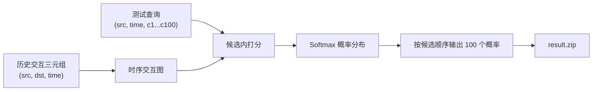
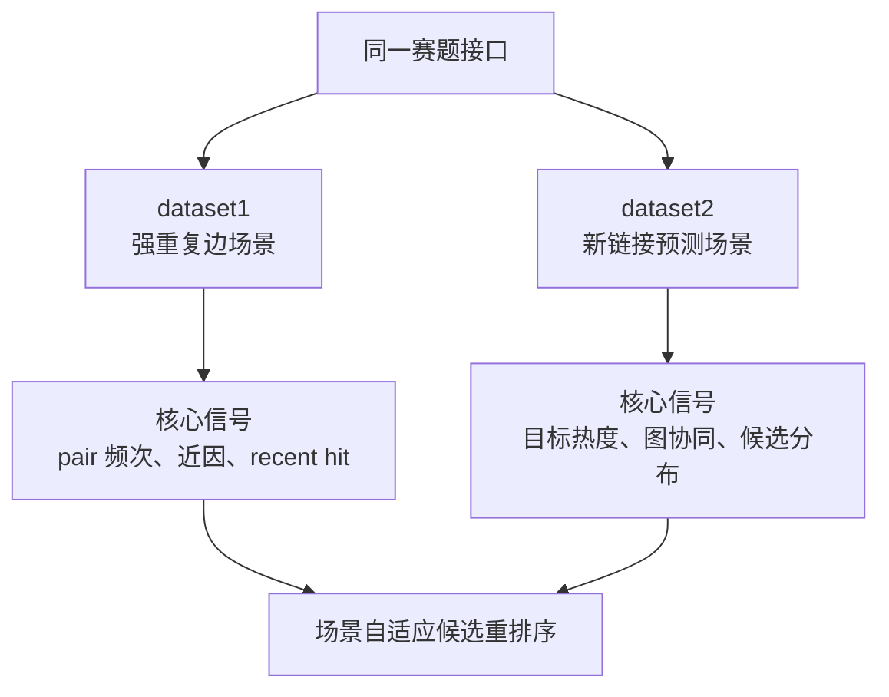
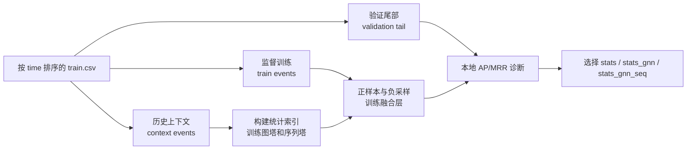
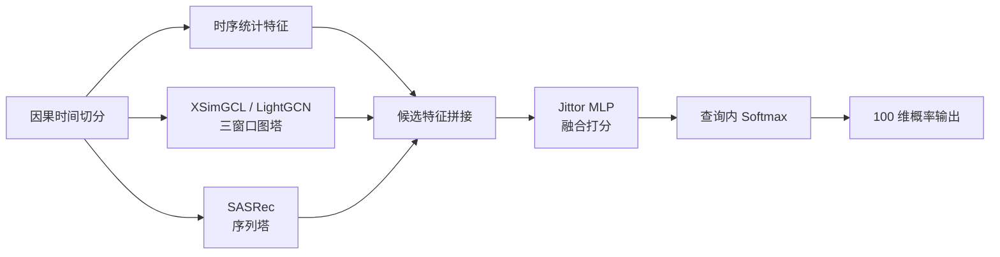

# 动态图候选重排序任务综述

## 摘要

第六届计图人工智能挑战赛赛道一“基于图学习的动态推荐任务”可以概括为一个时序图上的未来链接预测与候选重排序问题。给定历史交互三元组 `(src, dst, time)`，模型需要在测试时面对查询 `(src, time, c1...c100)`，判断该源节点在指定时间最可能与哪一个候选目标节点发生交互，并输出 100 个候选节点的概率分布。该任务与传统推荐系统、动态图学习和链接预测均有关，但其比赛接口有一个关键约束：候选目标节点已经给定。因此，研究重点不是从全体节点中大规模召回目标，而是在固定候选集合内进行因果、时序、图结构和统计信号联合建模。

从研究角度看，本赛题要求我们回答三个问题：第一，历史交互中哪些信号真正决定未来连接，包括重复关系、目标流行度、近期行为、源节点兴趣序列和高阶图协同关系；第二，如何在不泄露未来信息的前提下构造训练、验证和模型融合流程，使离线指标尽可能反映线上 MRR；第三，如何在 Jittor 和 JittorGeometric 框架下实现可扩展的模型，使其同时适应高重复边场景和新链接占主导的场景。本文以综述形式梳理任务定义、数据特性、相关方法、核心挑战和建议研究路线，目标是让参与项目的老师和同学明确“我们到底需要研究什么”。

关键词：动态图学习；推荐系统；候选重排序；未来链接预测；图神经网络；序列推荐；JittorGeometric

## 1. 引言

推荐系统、社交网络、交易网络、论文引用网络和网页跳转网络都可以被抽象为实体之间随时间发生的交互图。与静态图不同，时序图中的边具有发生时间，节点偏好和图结构会持续演化。模型不仅要知道“谁和谁过去发生过联系”，还要理解“这种联系何时发生、是否会重复、是否会转移到相似目标、近期行为是否改变了长期偏好”。

本赛题正是围绕这一类问题设计。训练数据由一系列 `(src, dst, time)` 交互事件构成，测试数据为每个源节点和查询时间提供 100 个候选目标节点。参赛系统需要为候选节点打分并归一化为概率，官方主要用 MRR 评价正确目标在排序中的位置。

因此，本项目不是一个泛化的内容推荐任务。当前数据只有 ID 与时间字段，没有文本、图像、类别、属性或知识图谱信息；比赛也禁止使用外部数据。它也不是完整召回问题，因为测试阶段候选集合已经固定。更准确地说，它是一个 **ID-only 时序交互图上的候选内链接重排序任务**。

## 2. 任务定义

### 2.1 图与事件

设训练集为按时间排列的交互事件集合：

$$
\mathcal{E} = \{(s_i, d_i, t_i)\}_{i=1}^{N}.
$$

其中 \(s_i\) 表示源节点，\(d_i\) 表示目标节点，\(t_i\) 表示交互时间。不同数据集可能对应不同场景：有些是二部图，`src` 和 `dst` 属于不同节点集合；有些是非二部图，源节点和目标节点来自同一实体集合。

测试集中的每一行查询为：

$$
q = (s_q, t_q, C_q), \qquad
C_q = \{c_1, c_2, \ldots, c_{100}\}.
$$

模型只能基于 `t_q` 之前可见的历史图，估计源节点 `s_q` 在时间 `t_q` 与每个候选 `c_j` 发生交互的可能性：

$$
z_j = f(s_q, c_j, t_q, \mathcal{E}_{<t_q}),
\qquad
p_j =
\frac{\exp(z_j)}
{\sum_{k=1}^{100}\exp(z_k)}.
$$

最终提交每个查询对应的 100 个概率值，顺序必须与测试集中 `c1...c100` 完全一致。

### 2.2 评价目标

官方评价使用 MRR。若真实目标在模型排序中位于第 `rank_i` 位，则该查询的倒数排名为：

$$
\operatorname{RR}_i = \frac{1}{\operatorname{rank}_i},
\qquad
\operatorname{MRR} =
\frac{1}{|\mathcal{Q}|}
\sum_{i=1}^{|\mathcal{Q}|}
\frac{1}{\operatorname{rank}_i}.
$$

这意味着模型最重要的目标是把真实目标排到候选列表最前面。提交文件要求概率在 `[0, 1]` 范围内并保留 8 位小数，但 MRR 本质上只关心相对排序。因此研究时应优先优化候选内排序质量，而不是单纯追求概率校准。

### 2.3 研究边界

本赛题的边界非常明确：

- 输入只有节点 ID 和时间，没有节点属性、边属性和内容特征。
- 测试时给定 100 个候选目标节点，任务是重排序，不是全库召回。
- 训练和推理必须遵守时间因果性，不能使用查询时间之后的交互。
- 每个数据集场景可以有不同模型、权重和参数，但提交格式必须统一。
- 比赛要求使用计图深度学习框架，当前工程以 Jittor 和 JittorGeometric 为主。
- 禁止使用比赛数据之外的外部数据。

这些边界决定了我们的研究重心应放在时序图结构、序列行为、统计规律、候选分布和排序损失上，而不是文本语义、生成式检索或跨域知识迁移。

## 3. 数据特性与问题形态

本地 A 榜数据画像显示，两个数据集虽然共享同一输入输出格式，但具有明显不同的问题形态。

| 指标                           | `dataset1` | `dataset2` |
| ------------------------------ | ---------: | ---------: |
| 训练边数                       |     690848 |    2261283 |
| 测试查询数                     |      61051 |     153420 |
| 唯一 `src`                     |      22093 |      12708 |
| 唯一 `dst`                     |      23012 |      50640 |
| 重复事件占比                   |     72.60% |      2.21% |
| holdout 中历史 pair 命中率     |     56.91% |     0.002% |
| holdout 中已知节点新 pair 占比 |     36.88% |     91.75% |

这组数据说明：

`dataset1` 更像强记忆型动态推荐。大量未来交互会重复历史 `(src, dst)` pair，因此 pair 频次、pair 近因、同源最近行为和目标热度是核心信号。对于此类数据，复杂图神经网络未必一定超过精心设计的统计特征。

`dataset2` 更像新链接预测。历史 pair 几乎不会在 holdout 中重复，大量未来边发生在训练中已经出现过的节点之间，但组合关系是新的。此时 pair 记忆特征基本失效，模型需要依靠目标流行度、图协同过滤、高阶邻域、源节点画像、候选分布和时间演化来泛化。

因此，本赛题不能被简化为单一推荐模式。我们需要研究一种能在不同场景之间自适应的候选重排序系统：在重复边场景中利用强记忆信号，在新链接场景中发挥图结构和序列泛化能力。

## 4. 相关研究谱系

### 4.1 统计记忆与协同过滤

最基础的推荐信号来自历史统计：源目标 pair 交互次数、重复率、最近交互时间、目标节点全局热度、源节点活跃度和时间衰减。这些方法简单但非常重要，因为很多真实推荐场景存在强重复行为和流行度偏置。

传统协同过滤进一步将用户和物品映射到隐向量空间，通过矩阵分解或隐式反馈排序目标学习潜在偏好。BPR 是隐式反馈推荐中经典的 pairwise 排序目标，适合从正负样本对中学习相对排序。对于本赛题，BPR 可以用于图塔或 embedding 塔训练，但最终提交仍需要在每行 100 个候选中做 list-wise 排序。

### 4.2 序列推荐

序列推荐关注源节点近期行为顺序。FPMC 将矩阵分解和一阶 Markov 转移结合；GRU4Rec 用循环神经网络建模 session；SASRec 用自注意力从历史序列中提取长期和短期兴趣；TiSASRec 进一步引入时间间隔信息。

在本赛题中，序列推荐的价值取决于数据是否存在可重复的行为顺序。如果源节点近期交互目标会影响下一次目标，那么 SASRec 或时间间隔特征可能有效。如果数据主要表现为全局新链接或候选分布偏置，纯序列塔可能收益有限。

### 4.3 图神经网络推荐

图推荐方法把交互矩阵视为图结构。NGCF 在 user-item 图上传播 embedding，显式建模高阶协同信号；LightGCN 去掉特征变换和非线性，只保留邻居传播与层聚合，成为图协同过滤中的强基线；SGL、SimGCL 和 XSimGCL 引入图对比学习或 embedding 扰动，提高稀疏场景中的鲁棒性。

对本赛题而言，LightGCN 和 XSimGCL 的定位很清楚：它们不负责召回，而是为每个给定候选提供图协同分数。若候选目标与源节点在交互图中存在高阶近邻关系，图塔就可能改善排序。

### 4.4 动态图学习

JODIE、TGAT、TGN、DyGFormer 等动态图模型直接面向连续时间事件流，通常维护随事件更新的节点状态、时间编码和邻域聚合机制。这类方法与题面中的“动态推荐”非常贴近，但工程复杂度和推理成本也更高。

当前项目更适合先采用轻量时间建模：多时间窗口图、时间衰减统计、近期序列、候选内 rank 特征。只有当这些方法证明时间图信号稳定有效后，再考虑完整的 TGN 或 DyGFormer 式事件流模型。

### 4.5 排序融合与特征交互

由于测试候选集合已经给定，最终问题接近工业推荐中的排序阶段。Wide & Deep、DCN、DIN、DIEN 等模型说明：强统计特征、目标感知历史聚合、特征交叉和深度融合在候选排序中非常重要。

本项目当前采用的路线是将统计特征、图塔分数和序列塔分数拼接，再用 Jittor MLP 输出候选 logits，并在每个查询的 100 个候选内做 softmax。这个设计符合赛题接口，也便于做消融实验。

## 5. 核心科学问题

### 5.1 记忆、热度、序列与图结构分别贡献什么

第一类问题是信号归因。我们需要判断每个场景中真正有效的是：

- 历史 `(src, dst)` pair 是否重复；
- 目标节点是否因为全局流行而更可能被选中；
- 源节点近期行为是否能预测下一次交互；
- 高阶图邻域是否能帮助发现新链接；
- 不同时间窗口中的图信号是否存在互补。

这要求实验不能只报告总分，还要报告 `stats`、`stats_gnn`、`stats_gnn_seq` 等特征组的对照结果。

### 5.2 如何保证时间因果性

动态图推荐最容易出现的错误是时间泄露。任何统计索引、图结构、序列样本和负采样都必须只使用查询时间之前的信息。本赛题中，如果训练或验证阶段不严格按时间切分，模型可能学到未来边，导致离线分数虚高但线上失败。

因此，我们需要把因果训练协议作为方法的一部分，而不是工程细节。验证集应从训练集尾部切出，模型先在历史上下文中训练，再在未来尾部事件上评估。

### 5.3 如何处理场景异质性

`dataset1` 和 `dataset2` 的差异说明同一比赛可能同时包含记忆型场景和新链接场景。单一模型若过度依赖历史 pair，会在新链接场景中失效；若完全忽略重复边，又会浪费强信号。

合理路线是建立场景自适应系统：先做数据画像，识别重复率、节点覆盖率、候选覆盖率、近期命中率和特征 AUC，再决定融合层是否采用图塔、序列塔或纯统计模型。

### 5.4 如何构造可信离线验证

当前项目已经观察到本地 MRR 与线上得分存在差距。这是推荐系统竞赛中的常见问题：离线负采样、时间切分和候选生成方式如果不贴近官方测试分布，就可能产生误导。

研究中需要区分三种指标：

- 训练损失：用于优化模型参数。
- 本地 AP/MRR：用于诊断排序能力。
- 线上 MRR：最终裁决模型是否有效。

没有经过线上锚点校准的离线提升不能直接视为真实提升。

### 5.5 如何在大规模数据上高效实现

B 榜可能包含百万级节点和千万级交互。模型必须控制内存、训练时间和推理时间。研究不仅包括模型准确率，也包括：

- ID 映射和稠密数组查询；
- 多窗口图构建成本；
- 负采样成本；
- 候选批量打分；
- CSV 输出和 zip 打包；
- JittorGeometric 模型在大图上的训练稳定性。

一个不能在正式规模上运行的高分离线模型，不是可用方案。

## 6. 当前工程基线

当前默认模型 `TemporalHybridRanker` 可概括为：

特征层包括：

- pair 记忆：`pair_strength`、`repeat_rate`、`pair_recency`；
- 近期行为：`recent_hit`、`src_recency`；
- 目标节点：`dst_popularity`、`dst_recency`;
- 图协同：`gnn_full`、`gnn_recent`、`gnn_short`;
- 序列偏好：`sasrec_score`。

训练时使用时间切分构造上下文、监督训练事件和验证尾部。融合层比较 `stats`、`stats_gnn`、`stats_gnn_seq` 三类特征组，并用本地验证选择最终提交特征组。这个机制的意义是防止图塔或序列塔在某个数据集上不收敛时拖累强统计基线。

## 7. 建议研究问题

面向后续课程汇报、实验设计和论文式总结，可以将本项目拆成以下研究问题。

| 编号 | 研究问题           | 需要回答的内容                                                          |
| ---- | ------------------ | ----------------------------------------------------------------------- |
| RQ1  | 赛题本质是什么     | 它是时序图候选重排序，而不是开放召回或通用生成式推荐。                  |
| RQ2  | 数据场景有何差异   | 哪些数据集是重复边主导，哪些是新链接主导，候选覆盖是否一致。            |
| RQ3  | 统计信号有多强     | pair 记忆、目标热度、近因和源节点活跃度的单特征区分度如何。             |
| RQ4  | 图学习是否带来增益 | LightGCN/XSimGCL 的候选分数是否在新链接场景中改善排序。                 |
| RQ5  | 序列模型是否必要   | SASRec 或时间间隔特征能否解释源节点近期兴趣变化。                       |
| RQ6  | 负采样如何影响排序 | random、popular、recent、history hard negative 与线上候选分布是否一致。 |
| RQ7  | 离线验证是否可信   | 本地 AP/MRR 与线上 MRR 的排序是否一致，是否存在代理验证偏差。           |
| RQ8  | 系统如何扩展       | 在 B 榜大规模图上如何控制图构建、训练、推理和输出成本。                 |

这些问题比“堆一个更复杂模型”更重要。只有先明确任务形态和验证协议，复杂模型才有评估意义。

## 8. 推荐实验协议

为了让老师和同学能复现实验并判断结论是否可靠，建议每个模型改动都采用统一协议：

1. 数据画像：记录训练边数、唯一节点数、重复 pair 比例、holdout 新链接比例和测试候选覆盖率。
2. 因果切分：按时间使用前段历史训练，尾部事件验证，避免随机切分造成未来泄露。
3. 基线对照：至少比较 `stats`、`stats + LightGCN`、`stats + XSimGCL`、`stats + XSimGCL + SASRec`。
4. 指标记录：分数据集记录 AP、MRR、选择的特征组、训练时间、推理时间和输出校验结果。
5. 消融实验：单独移除 pair、热度、近期、图塔、序列塔，观察每类信号贡献。
6. 多 seed 复测：对涉及随机初始化和负采样的模型至少用两个 seed 检查稳定性。
7. 线上锚点：所有结构性改动必须与当前线上冠军基线比较，不能只看局部离线提升。
8. 工程约束：确认输出 CSV 行列数、概率范围、8 位小数和 `result.zip` 结构符合提交要求。

## 9. 可能的研究路线

### 9.1 短期路线：强基线与可解释特征

短期目标是建立稳健可提交系统。优先研究统计特征、候选内 rank 特征、多窗口时间衰减、LightGCN/XSimGCL 图塔和 SASRec 序列塔的消融结果。该阶段的产出应包括清晰的数据画像、基线表格和失败实验归档。

### 9.2 中期路线：谱图协同与候选分布校准

当 LightGCN/XSimGCL 基线稳定后，可以研究 SVD-GCN、LightGCL、ChebyCF、GSPRec 等谱图过滤思想。其价值在于用低秩或图信号处理视角提取全局协同结构，可能比随机图增强更稳定。

同时，需要重点研究候选分布校准。训练负样本如果与测试候选分布差异过大，本地 MRR 会偏乐观。可尝试从目标热度、近期活跃目标、历史候选和图近邻中构造混合负例，但必须接受线上验证。

### 9.3 长期路线：事件级动态图模型

若多窗口静态图和序列模型仍无法覆盖新链接场景，可以考虑完整动态图模型，如 TGN、TGAT 或 DyGFormer。这类模型能够显式维护节点 memory 和时间编码，但实现代价较高。建议只有在轻量时间图特征已证明有用之后，再进入长期路线。

## 10. 结论

本比赛的研究对象可以被一句话概括：**在只有 ID 与时间信息的动态交互图中，针对每个查询给定的 100 个候选目标节点，学习一个遵守时间因果性的候选重排序模型，使真实未来交互尽可能排在前列。**

因此，我们需要研究的不是单纯的“用 GNN 做推荐”，而是一个由数据画像、因果验证、统计记忆、图协同过滤、序列兴趣建模、候选分布校准和高效工程实现共同构成的问题。面向老师和同学的汇报应围绕以下主线展开：

- 任务形式：时序图未来链接预测，比赛接口为候选内重排序。
- 数据矛盾：不同场景可能分别由重复边记忆和新链接泛化主导。
- 方法体系：统计特征是强基线，GNN 和序列模型是候选排序增益来源。
- 实验原则：所有提升必须在因果切分、多 seed 和线上锚点下验证。
- 工程目标：在 Jittor/JittorGeometric 中实现可提交、可复现、可扩展的模型。

这一路线能把竞赛问题转化为可研究、可实验、可汇报的学术问题。

## 参考资料

- [赛道一：基于图学习的动态推荐任务](../task/competition.md)
- [当前数据画像](../task/data-profile.md)
- [模型设计](../system/modeling.md)
- [实验与基准](../experiments/benchmarks.md)
- [推荐系统论文调研归档](recommender-survey.md)
- [GNN 推荐论文调研](gnn-survey.md)
- Rendle et al. [BPR: Bayesian Personalized Ranking from Implicit Feedback](https://arxiv.org/abs/1205.2618)
- He et al. [LightGCN: Simplifying and Powering Graph Convolution Network for Recommendation](https://arxiv.org/abs/2002.02126)
- Yu et al. [XSimGCL: Towards Extremely Simple Graph Contrastive Learning for Recommendation](https://arxiv.org/abs/2209.02544)
- Kang and McAuley. [SASRec: Self-Attentive Sequential Recommendation](https://arxiv.org/abs/1808.09781)
- Kumar et al. [JODIE: Predicting Dynamic Embedding Trajectory in Temporal Interaction Networks](https://faculty.cc.gatech.edu/~skumar498/pubs/jodie-kdd2019.pdf)
- Xu et al. [TGAT: Inductive Representation Learning on Temporal Graphs](https://arxiv.org/abs/2002.07962)
- Rossi et al. [TGN: Temporal Graph Networks for Deep Learning on Dynamic Graphs](https://arxiv.org/abs/2006.10637)
