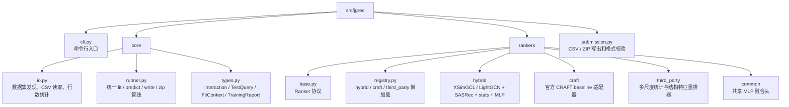
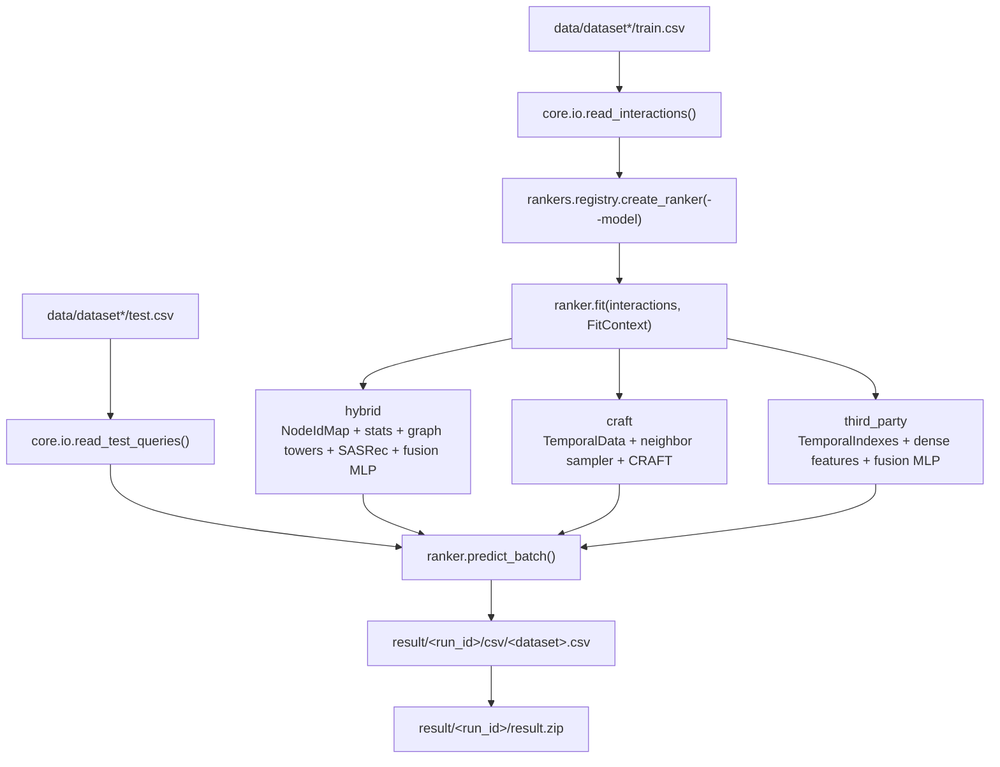

# 系统架构

## 包结构



## 统一接口

所有模型都实现同一个 `Ranker` 协议：

```python
ranker.fit(interactions, context) -> TrainingReport
ranker.predict_batch(queries) -> np.ndarray  # shape=(batch, 100)
```

`jgrec.core.runner.build_dataset_submission()` 只依赖这个接口，不关心底层模型是当前 hybrid、CRAFT，还是第三方统计结构模型。

## 模型后端

| 后端           | CLI                   | 说明                                                                                                                          |
| -------------- | --------------------- | ----------------------------------------------------------------------------------------------------------------------------- |
| 当前模型       | `--model hybrid`      | 默认后端，XSimGCL/LightGCN 图塔、SASRec 序列塔、统计特征和 MLP 融合。                                                         |
| CRAFT baseline | `--model craft`       | 官方 CRAFT baseline 逻辑已迁入 `rankers/craft`，接入统一提交管线。                                                            |
| 第三方方案     | `--model third_party` | 基于多尺度时间统计、反向边、共同邻居、cooccur/transition 特征的 MLP 重排器。当前只重排 test.csv 给定的 100 候选，不额外召回。 |

## 数据流



## 运行边界

每个数据集都会创建新的 ranker 实例，避免跨数据集状态污染。`submission.py` 只负责输出格式和 ZIP，不再 import 任何具体模型。

CRAFT 的正式统一入口是：

```bash
uv run jgrec-build --model craft
```

## 工程约束

- 不使用比赛外部数据。
- 输出文件无表头。
- 每行必须对应测试集同一行的 100 个候选节点顺序。
- 每个概率必须保留 8 位小数。
- `data/` 和 `result/` 不提交到仓库。

## 扩展规则

新增模型时只需要：

1. 在 `src/jgrec/rankers/<name>/` 实现 `Ranker`。
2. 在 `rankers/registry.py` 注册懒加载 factory。
3. 在 `cli.py` 增加必要配置参数。

只要 `predict_batch()` 返回 `(batch, 100)` 概率矩阵，runner、submission 和 zip 打包不需要改。
