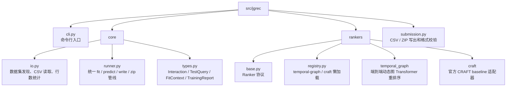
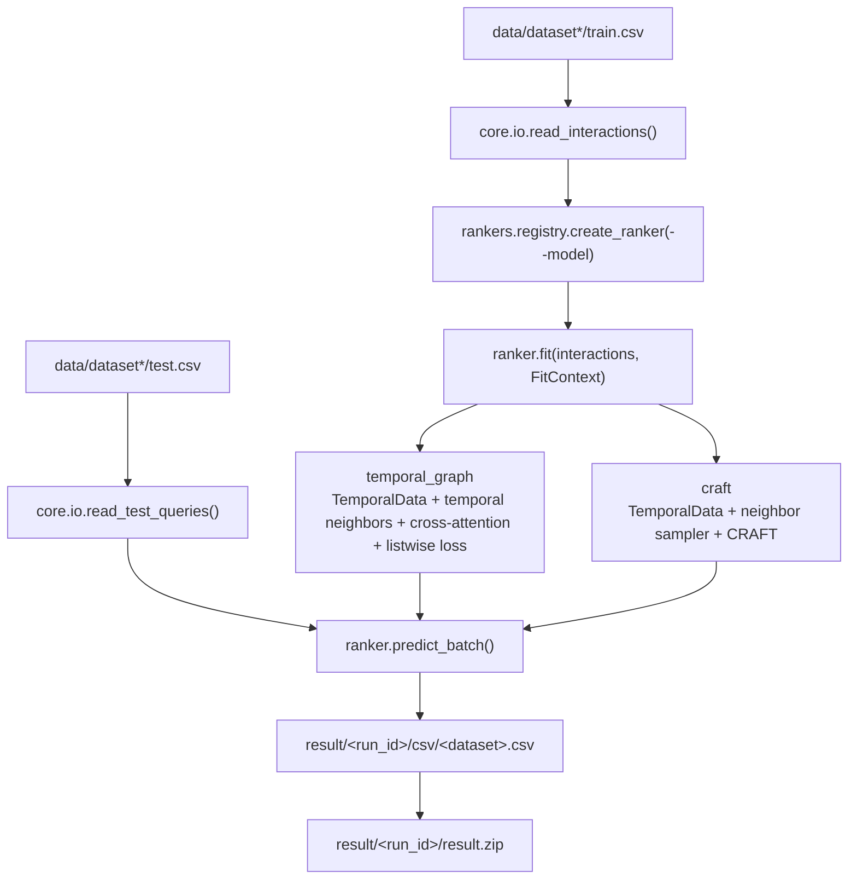

# 系统架构

## 包结构


```mermaid
flowchart TB
    A["src/jgrec"] --> B["cli.py<br/>命令行入口"]
    A --> C["core"]
    C --> C1["io.py<br/>数据集发现、CSV 读取、行数统计"]
    C --> C2["runner.py<br/>统一 fit / predict / write / zip 管线"]
    C --> C3["types.py<br/>Interaction / TestQuery / FitContext / TrainingReport"]
    A --> D["rankers"]
    D --> D1["base.py<br/>Ranker 协议"]
    D --> D2["registry.py<br/>temporal-graph / craft 懒加载"]
    D --> D3["temporal_graph<br/>端到端动态图 Transformer 重排序"]
    D --> D4["craft<br/>官方 CRAFT baseline 适配器"]
    A --> E["submission.py<br/>CSV / ZIP 写出和格式校验"]
```

## 统一接口

所有模型都实现同一个 `Ranker` 协议：

```python
ranker.fit(interactions, context) -> TrainingReport
ranker.predict_batch(queries) -> np.ndarray  # shape=(batch, 100)
```

`jgrec.core.runner.build_dataset_submission()` 只依赖这个接口，不关心底层模型是当前 temporal-graph 还是 CRAFT。

## 模型后端

| 后端           | CLI                   | 说明                                                                                                                          |
| -------------- | --------------------- | ----------------------------------------------------------------------------------------------------------------------------- |
| 当前模型       | `--model temporal-graph` | 默认后端，JittorGeometric temporal sampler + CRAFT-style cross-attention + 候选集 softmax 端到端训练。 |
| CRAFT baseline | `--model craft`       | 官方 CRAFT baseline 逻辑已迁入 `rankers/craft`，接入统一提交管线。                                                            |

## 数据流


```mermaid
flowchart TB
    Train["data/dataset*/train.csv"] --> ReadTrain["core.io.read_interactions()"]
    ReadTrain --> Create["rankers.registry.create_ranker(--model)"]
    Create --> Fit["ranker.fit(interactions, FitContext)"]
    Fit --> H["temporal_graph<br/>TemporalData + temporal neighbors + cross-attention + listwise loss"]
    Fit --> C["craft<br/>TemporalData + neighbor sampler + CRAFT"]

    Test["data/dataset*/test.csv"] --> ReadTest["core.io.read_test_queries()"]
    ReadTest --> Predict["ranker.predict_batch()"]
    H --> Predict
    C --> Predict
    Predict --> CSV["result/&lt;run_id&gt;/csv/&lt;dataset&gt;.csv"]
    CSV --> ZIP["result/&lt;run_id&gt;/result.zip"]
```

## 运行边界

每个数据集都会创建新的 ranker 实例，避免跨数据集状态污染。`submission.py` 只负责输出格式和 ZIP，不再 import 任何具体模型。

CRAFT 的正式统一入口是：

```bash
uv run jgrec-build --model craft
```

## 工程约束

- 不使用比赛外部数据。
- 输出文件无表头。
- 每行必须对应测试集同一行的 100 个候选节点顺序。
- 每个概率必须保留 8 位小数。
- `data/` 和 `result/` 不提交到仓库。

## 扩展规则

新增模型时只需要：

1. 在 `src/jgrec/rankers/<name>/` 实现 `Ranker`。
2. 在 `rankers/registry.py` 注册懒加载 factory。
3. 在 `cli.py` 增加必要配置参数。

只要 `predict_batch()` 返回 `(batch, 100)` 概率矩阵，runner、submission 和 zip 打包不需要改。
