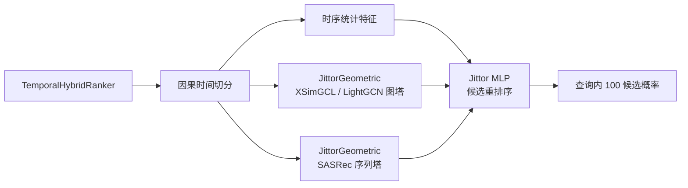
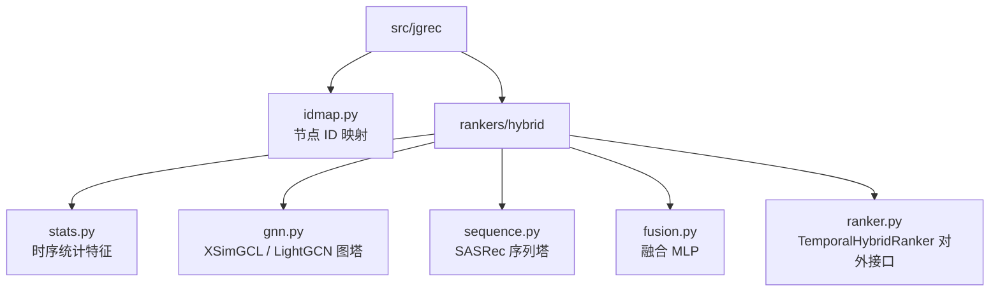
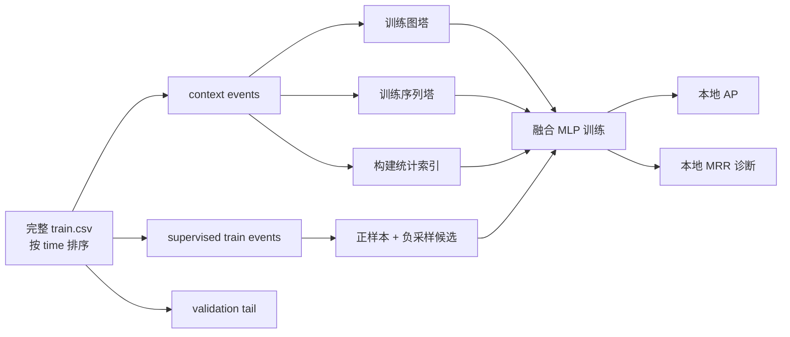
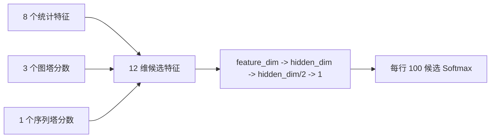

# 模型方案

## 当前定位

当前实现已经从统计线性模型切换为激进的混合图推荐模型：



目标不是做通用 link prediction，而是直接优化赛题的 100 个候选节点重排序。

## 模块划分

实现位置：



对外接口保持稳定：

```python
ranker = TemporalHybridRanker(recent_window=32)
report = ranker.fit(interactions, training_config=config)
probs = ranker.predict_batch(queries)
```

## 因果训练流程

每个数据集单独训练：



监督样本第一个候选固定为真实目标：

```text
[positive_dst, negative_1, negative_2, ...]
```

融合层使用候选集 softmax cross entropy：

设每个监督样本包含 \(K+1\) 个候选，且第 1 个候选为真实目标。融合层输出 logits \(\mathbf{z}_i \in \mathbb{R}^{K+1}\)，训练目标为：

\[
p_{i,j}
= \frac{\exp(z_{i,j})}
{\sum_{\ell=1}^{K+1}\exp(z_{i,\ell})},
\qquad
\mathcal{L}
= -\frac{1}{B}\sum_{i=1}^{B}\log p_{i,1}.
\]

默认验证选择指标是 AP，对齐官方 CRAFT baseline 的 early stopping 口径；融合 MLP 的 early stop patience 默认为 10。MRR 继续保留为比赛指标诊断：

AP 使用 sklearn 的 `average_precision_score`，将候选标签和候选分数展平后计算：

MRR 计算方式：

\[
\operatorname{AP}
= \operatorname{average\_precision}(\operatorname{vec}(Y), \operatorname{vec}(S)).
\]

MRR 只比较每行正样本分数和负样本分数：

\[
\operatorname{rank}_i
= 1 + \sum_{j=2}^{K+1}
\mathbf{1}\left[s_{i,j} > s_{i,1}\right],
\qquad
\operatorname{MRR}
= \frac{1}{B}\sum_{i=1}^{B}
\frac{1}{\operatorname{rank}_i}.
\]

训练完成后，模型会用完整训练历史重新训练图塔、序列塔和统计索引，再对正式 `test.csv` 输出概率。

## 图塔

图塔使用 `third_party/JittorGeometric`：

- 默认模型：`XSimGCL`
- 可选模型：`LightGCN`
- 图结构：二部图 `src <-> dst`
- 训练目标：BPR，XSimGCL 额外使用对比学习扰动

当前训练三个时间窗口：

| 特征名       | 边窗口      | 目的         |
| ------------ | ----------- | ------------ |
| `gnn_full`   | 全量历史边  | 长期协同过滤 |
| `gnn_recent` | 最近 35% 边 | 近期偏好     |
| `gnn_short`  | 最近 10% 边 | 短期趋势     |

每个窗口输出：

\[
s_{\text{gnn}}(s, d)
= \mathbf{e}_{s}^{\top}\mathbf{e}_{d}.
\]

## 序列塔

序列塔使用 JittorGeometric 的 `SASRec` 实现。每个 `src` 的历史目标节点序列作为行为序列：

```text
src: dst_1, dst_2, dst_3, ...
```

训练时用历史前缀预测下一个 `dst`，使用 BPR 损失。预测时对每个候选输出：

\[
s_{\text{seq}}(s, d, t)
= \mathbf{h}_{s,<t}^{\top}\mathbf{e}_{d}.
\]

序列塔用于补图塔的短板：LightGCN/XSimGCL 更偏静态协同过滤，SASRec 负责顺序兴趣变化。

## 统计特征

统计特征继续保留，作为强规则信号和冷启动兜底：

| 特征             | 含义                                             |
| ---------------- | ------------------------------------------------ |
| `pair_strength`  | \(\log(1 + n_{s,d})\)，源目标历史强度            |
| `repeat_rate`    | \(n_{s,d} / \max(n_s, 1)\)，源节点历史中该目标占比 |
| `pair_recency`   | \(\exp(-\Delta t_{s,d} / T)\)，源目标最近交互衰减 |
| `dst_popularity` | \(\log(1+n_d) / \log(1+N)\)，目标节点全局热度    |
| `dst_recency`    | \(\exp(-\Delta t_d / T)\)，目标节点最近被交互的时间衰减 |
| `recent_hit`     | 若目标在源节点最近窗口中，则为 \(1 / \operatorname{rank}_{\text{recent}}\) |
| `src_activity`   | \(\log(1+n_s) / \log(1+N)\)，源节点历史活跃度    |
| `src_recency`    | \(\exp(-\Delta t_s / T)\)，源节点最近活跃度      |

其中 \(N\) 是统计索引中的总边数，\(T=\max(t_{\max}-t_{\min}, 1)\) 是训练历史时间跨度。

## 融合层

最终候选特征为：



融合层是 Jittor MLP，输出 logits 后在每行 100 个候选内做 softmax，得到提交概率。

\[
\mathbf{x}_{s,d,t}
= [\mathbf{x}_{\text{stats}},\ \mathbf{x}_{\text{gnn}},\ s_{\text{seq}}],
\qquad
z_{s,d,t} = \operatorname{MLP}(\mathbf{x}_{s,d,t}).
\]

融合训练会同时比较以下候选特征组：

- `stats`
- `stats_gnn`
- `stats_gnn_seq`

最终默认使用本地验证 AP 最高的一组。若验证选择 `stats`，最终全量拟合阶段会跳过图塔和序列塔训练，避免未收敛图特征拖慢并拖垮提交结果。

## 关键参数

| 参数                    | 默认值    | 说明                         |
| ----------------------- | --------- | ---------------------------- |
| `--gnn-model`           | `xsimgcl` | 图塔模型，可选 `lightgcn`    |
| `--gnn-embedding-dim`   | `128`     | 图 embedding 维度            |
| `--gnn-layers`          | `2`       | 图传播层数                   |
| `--gnn-epochs`          | `3`       | 每个图窗口训练轮数           |
| `--gnn-max-graph-edges` | `0`       | 每个图窗口最多建图边数       |
| `--gnn-max-train-edges` | `40000`   | 每轮图训练采样边数           |
| `--seq-epochs`          | `3`       | SASRec 训练轮数              |
| `--seq-max-samples`     | `50000`   | SASRec 最多训练样本          |
| `--seq-max-len`         | `64`      | 源节点历史序列长度           |
| `--seq-hidden-size`     | `128`     | SASRec hidden size           |
| `--fusion-hidden-dim`   | `64`      | 最终 MLP hidden width        |
| `--max-fit-events`      | `0`       | 训练历史尾部截断，0 表示全量 |

## 当前取舍

- 选择 XSimGCL/LightGCN 作为主图模型，因为它直接服务推荐排序，工程风险低于 TGN/DyGFormer。
- 保留 SASRec，因为测试查询带时间，源节点近期行为顺序很可能有收益。
- 保留统计特征，因为重复交互、目标热度和近因信号在该赛题中非常强。
- 使用 MLP 融合而不是直接加权，避免手工调不同模型分数尺度。
- TGN/DyGFormer 暂不作为主线；它们更适合事件级动态 link prediction，直接迁移到 100 候选 MRR 风险更高。

## 验证策略

每次模型改动至少记录：

- `stats + MLP`
- `LightGCN + SASRec + stats + MLP`
- `XSimGCL + SASRec + stats + MLP`

需要同时记录本地 AP、本地 MRR、训练耗时、推理耗时和输出校验结果。性能与质量数据统一写入 [实验与基准](../experiments/benchmarks.md)。
