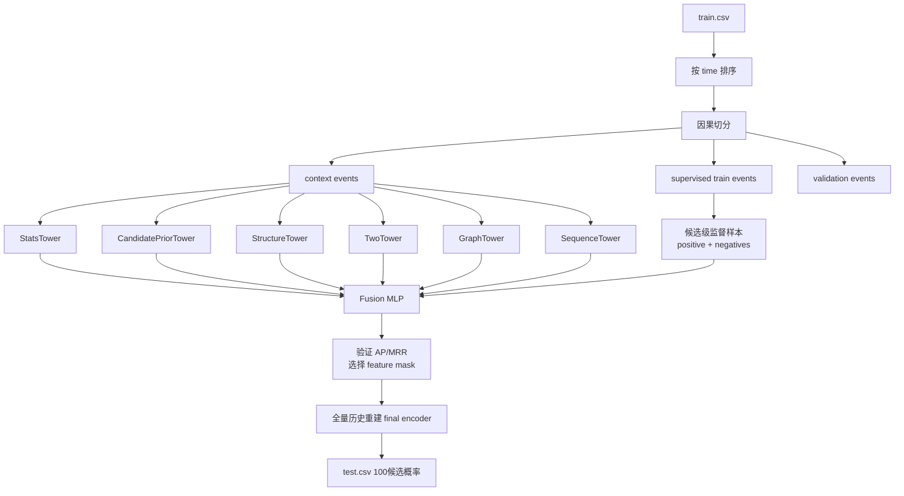

# 模型设计

## 问题建模

赛题输入是按时间排序的交互三元组：

\[
e_i = (s_i, d_i, t_i)
\]

测试阶段每一行给定一个源节点、查询时间和 100 个候选目标：

\[
q_i = (s_i, t_i, c_{i,1}, \ldots, c_{i,100})
\]

模型不需要在全量节点空间召回，而是需要在这 100 个候选内做重排序，并输出概率：

\[
P_i \in [0,1]^{100}
\]

因此当前主线不是单纯做 link prediction，而是做候选级 ranking。所有模型特征最后都服务于
“正样本在 100 个候选中的排序位置”。

## 总体结构

当前默认后端是 `TemporalHybridRanker`，位于 `src/jgrec/rankers/hybrid/`。


```mermaid
flowchart TB
    A["train.csv"] --> B["按 time 排序"]
    B --> C["因果切分"]
    C --> D["context events"]
    C --> E["supervised train events"]
    C --> F["validation events"]

    D --> S["StatsTower"]
    D --> P["CandidatePriorTower"]
    D --> R["StructureTower"]
    D --> T["TwoTower"]
    D --> G["GraphTower"]
    D --> Q["SequenceTower"]

    E --> X["候选级监督样本<br/>positive + negatives"]
    S --> M["Fusion MLP"]
    P --> M
    R --> M
    T --> M
    G --> M
    Q --> M
    X --> M
    M --> V["验证 AP/MRR<br/>选择 feature mask"]
    V --> Z["全量历史重建 final encoder"]
    Z --> O["test.csv 100候选概率"]
```

特征顺序固定为：

```text
stats + candidate_prior + structure + two_tower + graph + sequence
```

最终使用的特征组由验证集选择，候选 mask 包括：

```text
stats
stats_prior
stats_prior_structure
stats_prior_structure_tower
stats_prior_structure_tower_gnn
stats_prior_structure_tower_gnn_seq
```

这样设计的原因是：不同数据集的规律差异很大。重复交互型数据中，历史 pair 记忆和近因特征很强；
新链接/冷启动型数据中，很多目标节点在训练中未见，此时 test 候选分布、结构共现和表示学习特征更重要。
验证选择让模型可以保留复杂特征，同时避免某个塔在特定数据集上退化时强行进入最终提交。

## 时间因果训练

训练不会用未来信息构造监督特征。对每个数据集，先按时间排序，然后切分为：

- `context_events`：用于拟合训练阶段的特征塔。
- `train_events`：用于构造融合器训练样本。
- `val_context_events`：用于拟合验证阶段的特征塔。
- `val_events`：用于选择 fusion mask、早停和报告 AP/MRR。

伪代码：

```python
interactions.sort(key=lambda item: item.time)
val_size = int(len(interactions) * val_ratio)
train_end = len(interactions) - val_size
context_end = int(train_end * context_ratio)

context_events = interactions[:context_end]
train_events = interactions[context_end:train_end]
val_context_events = interactions[:train_end]
val_events = interactions[train_end:]
```

`--max-train-events` 和 `--max-val-events` 只限制融合器的监督训练/验证事件数，不代表最终模型没有使用全量历史。
正式预测前，final encoder 会用完整可用训练历史重新拟合：

```text
--max-fit-events 0 -> 不截断 train.csv，final encoder 使用完整历史。
```

## 自动数据画像路由

A/B 榜不能依赖 `dataset1`、`dataset2` 这样的名称做手工策略。因此当前实现使用数据统计自动判断模式：

| 指标 | 含义 |
| ---- | ---- |
| `holdout_pair_hit_rate` | holdout 中的真实 pair 是否已在更早历史出现。 |
| `holdout_new_pair_rate` | holdout 中新 pair 的比例。 |
| `candidate_unseen_dst_rate` | test 候选目标中训练未见目标的比例。 |
| `candidate_seen_dst_rate` | test 候选目标中训练已见目标的比例。 |
| `src_history_p90` | 源节点历史长度的 90 分位。 |
| `test_candidate_top1pct_share` | test 候选分布头部集中度。 |

固定规则：

```text
repeat_memory:
  holdout_pair_hit_rate >= 0.25 and candidate_unseen_dst_rate <= 0.20

new_link_cold:
  holdout_pair_hit_rate < 0.10 and candidate_unseen_dst_rate >= 0.30

balanced:
  otherwise
```

不同模式会自动调整 test-candidate 负采样比例：

| 模式 | `test_candidate_negative_ratio` |
| ---- | ------------------------------: |
| `repeat_memory` | 0.10 |
| `balanced` | 0.35 |
| `new_link_cold` | 0.60 |

该策略只使用 `train.csv` 和无标签 `test.csv` 候选分布，不读取答案，不按数据集名称分支。

## 特征塔

### StatsTower

统计塔是强基线，也是冷启动兜底。主要特征包括：

| 特征类型 | 作用 |
| -------- | ---- |
| pair 记忆 | 历史上 `src -> dst` 是否重复出现、重复强度和重复占比。 |
| 时间近因 | pair、src、dst 的最近交互距离。 |
| 近期窗口 | 候选是否出现在源节点最近行为中。 |
| 节点热度 | 目标节点全局流行度、源节点活跃度。 |

这类特征对 `repeat_memory` 数据尤其关键，因为线上候选中存在大量历史重复交互。

### CandidatePriorTower

候选先验塔只使用 `test.csv` 中的候选集合统计，不使用标签。它解决 `new_link_cold` 场景中训练未见目标全零的问题。

特征包括：

```text
candidate_train_seen
candidate_test_freq
candidate_unseen_test_freq
candidate_dst_pop_row_rank
candidate_dst_recency_row_rank
candidate_test_freq_row_rank
```

其中 `candidate_test_freq` 表示目标节点在测试候选中出现的频次。若某个 `dst` 在训练中未见，但在 test
候选中高频出现，该塔仍能给出非零信号。

### StructureTower

结构塔建模源节点历史邻居和候选目标的局部图关系：

| 特征 | 含义 |
| ---- | ---- |
| `dst_unique_src` | 目标节点历史来源数量。 |
| `dst_pop_rank` | 目标热度的压缩 rank 信号。 |
| `reverse_log_count` | 反向交互 `dst -> src` 计数。 |
| `reverse_recency` | 反向交互近因。 |
| `common_neighbors` | 源历史目标与候选目标历史来源的交集。 |
| `jaccard` | 局部邻域 Jaccard。 |
| `cooccur_score` | 源历史目标和候选目标在其他源节点历史中的共现。 |
| `transition_score` | 最近目标到候选目标的转移计数。 |

正式测试时间通常晚于训练时间。当前实现会在满足条件时启用 future-only 压缩索引：保留等价的计数图，
释放共现/转移时间数组，降低内存。同时对大历史源节点使用共现预聚合缓存，避免 dataset2 推理阶段重复暴力查询。

### TwoTower

Two-Tower 是轻量 Jittor 表示学习塔。输入包含：

- source id
- source activity bucket
- source recency bucket
- destination id
- destination popularity bucket
- destination recency bucket
- time bucket

训练目标为 sampled-softmax。每个正样本配 `num_negatives` 个负样本，负采样策略与融合器共享，
避免两套负采样逻辑漂移。输出两个候选级特征：

```text
two_tower_dot
two_tower_cosine
```

Two-Tower 不替代统计和结构特征，而是补充低维表示相似度。

### GraphTower

图塔支持 XSimGCL 和 LightGCN。当前冲分主线使用：

```text
--gnn-model xsimgcl
--gnn-edge-weighting none
```

图塔按多个时间窗口训练，输出候选点积特征：

```text
gnn_full
gnn_recent
gnn_short
```

图塔的价值在于捕捉高阶协同过滤关系。它通常能补足纯统计特征看不到的相似源节点行为，但在
冷启动目标占比很高时收益会受限，因此最终是否使用由 fusion mask 验证决定。

### SequenceTower

序列塔建模每个源节点的目标序列：

```text
src: dst_1, dst_2, dst_3, ...
```

当前支持 SASRec/GRU 方向的序列特征。预测时输出候选目标与源节点历史状态的匹配分数。序列塔用于捕捉短期兴趣转移，
与图塔的静态协同信号互补。

## 融合器

对每个监督事件构造候选集合：

```text
[positive_dst, negative_1, negative_2, ...]
```

Fusion MLP 对候选特征输出 logit：

\[
z_{i,j} = f_\theta(x_{i,j})
\]

在同一行候选内做 softmax：

\[
p_{i,j}
= \frac{\exp(z_{i,j})}
{\sum_{\ell=1}^{K+1}\exp(z_{i,\ell})}
\]

训练目标：

\[
\mathcal{L}
= -\frac{1}{B}\sum_{i=1}^{B}\log p_{i,1}
\]

验证指标：

\[
\operatorname{rank}_i
= 1 + \sum_{j=2}^{K+1} \mathbf{1}[s_{i,j} > s_{i,1}]
\]

\[
\operatorname{MRR}
= \frac{1}{B}\sum_{i=1}^{B}\frac{1}{\operatorname{rank}_i}
\]

默认 `selection_metric=ap`，也可以设置 `--selection-metric mrr` 与线上 MRR 评分口径对齐。

## Dataset1 与 Dataset2 的建模差异

当前代码不按数据集名称切策略，但 A 榜两个数据集呈现出不同画像：

- `dataset1` 更接近重复记忆/稳定偏好型。历史 pair、近因、近期窗口和图协同过滤通常更可靠。
- `dataset2` 更接近新链接/冷启动型。测试候选中未见目标比例高，单纯依赖历史 pair 会失效，需要候选先验、
  test-candidate 负采样校准、结构共现和表示学习共同补充。

这种差异通过 `auto_strategy` 自动检测，而不是硬编码 `dataset1` 或 `dataset2`。这样 B 榜换数据时，代码仍按数据统计自适应。

## 工程取舍

- 质量优先：默认不关闭 `candidate_prior`、`structure`、`two_tower`、`gnn`、`sequence`。
- 内存可控：监督特征支持 memmap，fusion 支持流式训练和验证。
- 推理可观测：`memory.log` 记录阶段级 RSS、可用内存和 `feature-profile`。
- 兼容 CPU smoke：禁用 GNN/sequence 后，CLI 导入不触发 `jittor_geometric` CUDA 编译路径。
- 正式提交：不用 `--limit-rows`，输出 CSV 行数必须匹配完整 `test.csv`。
