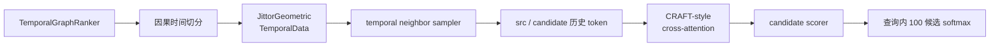
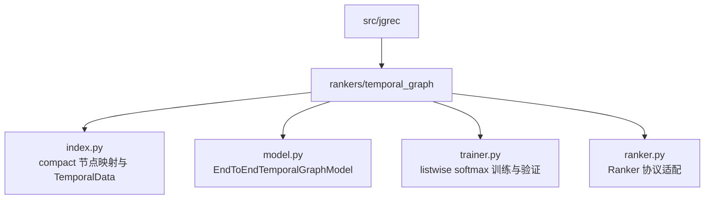

# 模型方案

## 当前定位

当前默认后端是 `temporal-graph`：一个端到端训练的动态图候选重排序模型。它不再把图塔、序列塔、统计特征先训练成固定分数，再交给融合 MLP；而是直接从因果历史图构造候选级 token，用同一个候选集 softmax loss 更新所有神经参数。


```mermaid
flowchart LR
    A["TemporalGraphRanker"] --> B["因果时间切分"]
    B --> C["JittorGeometric<br/>TemporalData"]
    C --> D["temporal neighbor sampler"]
    D --> E["src / candidate 历史 token"]
    E --> F["CRAFT-style<br/>cross-attention"]
    F --> G["candidate scorer"]
    G --> H["查询内 100 候选 softmax"]
```

目标不是通用 link prediction，而是直接优化赛题的固定候选集重排序。

## 模块划分

实现位置：


```mermaid
flowchart TB
    A["src/jgrec"] --> B["rankers/temporal_graph"]
    B --> C["index.py<br/>compact 节点映射与 TemporalData"]
    B --> D["model.py<br/>EndToEndTemporalGraphModel"]
    B --> E["trainer.py<br/>listwise softmax 训练与验证"]
    B --> F["ranker.py<br/>Ranker 协议适配"]
```

`src` 和 `dst` 被映射到同一个 compact node id 空间，`0` 保留为 padding。这样可以直接使用 JittorGeometric 的 temporal neighbor sampler，同时避免原始节点 ID 稀疏导致 embedding 表膨胀。

## 训练目标

每个监督样本第一个候选固定为真实目标：

```text
[positive_dst, negative_1, negative_2, ...]
```

模型输出候选 logits \(\mathbf{z}_i \in \mathbb{R}^{K+1}\)，训练目标是候选集 softmax cross entropy：

\[
p_{i,j}
= \frac{\exp(z_{i,j})}
{\sum_{\ell=1}^{K+1}\exp(z_{i,\ell})},
\qquad
\mathcal{L}
= -\frac{1}{B}\sum_{i=1}^{B}\log p_{i,1}.
\]

这个 loss 会同时更新：

- 节点 embedding；
- 历史聚合式 temporal memory update；
- CRAFT-style cross-attention；
- pair statistics projection；
- candidate scorer。

## 图建模

模型使用 JittorGeometric 的 `TemporalData` 和 `get_neighbor_sampler(..., "recent")`。对任意训练事件或测试 query，邻居采样都使用 `time < query_time` 的历史交互，避免时间泄漏。

对每个 `(src, candidate, time)`，模型构造：

- `src` 最近 `--history-len` 个历史邻居；
- candidate 最近 `--candidate-history-len` 个历史邻居；
- src/candidate 自身 embedding；
- log delta-time encoding；
- repeat/common-history 统计 token。

候选 embedding 作为 query，src/candidate 历史 token 作为 key/value，经 cross-attention 得到候选表示，再输出候选 logit。

## 关键参数

| 参数                      | 默认值 | 说明                         |
| ------------------------- | ------ | ---------------------------- |
| `--model`                 | `temporal-graph` | 默认端到端动态图后端 |
| `--history-len`           | `64`   | 每个 src 的历史邻居长度      |
| `--candidate-history-len` | `32`   | 每个候选节点的历史邻居长度   |
| `--hidden-size`           | `128`  | embedding 与 attention 宽度  |
| `--layers`                | `3`    | cross-attention 层数         |
| `--heads`                 | `4`    | attention heads              |
| `--num-negatives`         | `99`   | 默认训练候选数对齐测试 100 候选 |
| `--no-refit-full`         | `false` | 验证选择后是否跳过全量重训   |
| `--max-fit-events`        | `0`    | 训练历史尾部截断，0 表示全量 |

## 验证策略

验证仍使用时间尾部切分。AP 使用 sklearn 的 `average_precision_score`，将候选标签和候选分数展平后计算；MRR 只比较每行正样本分数和负样本分数：

\[
\operatorname{rank}_i
= 1 + \sum_{j=2}^{K+1}
\mathbf{1}\left[s_{i,j} > s_{i,1}\right],
\qquad
\operatorname{MRR}
= \frac{1}{B}\sum_{i=1}^{B}
\frac{1}{\operatorname{rank}_i}.
\]

训练完成后，默认按验证最佳 epoch 在完整训练历史上重新训练一次，再对正式 `test.csv` 输出概率。
